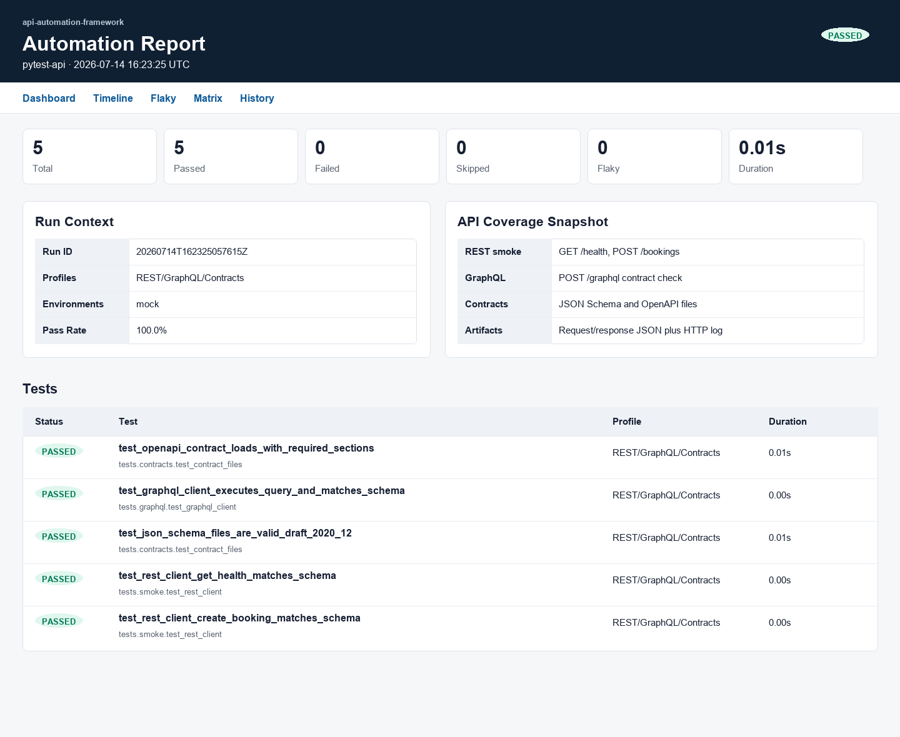
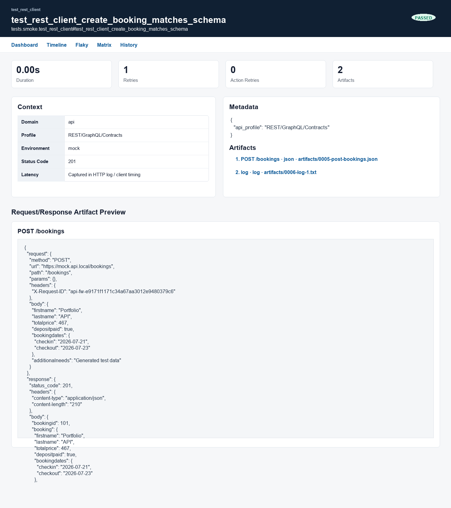
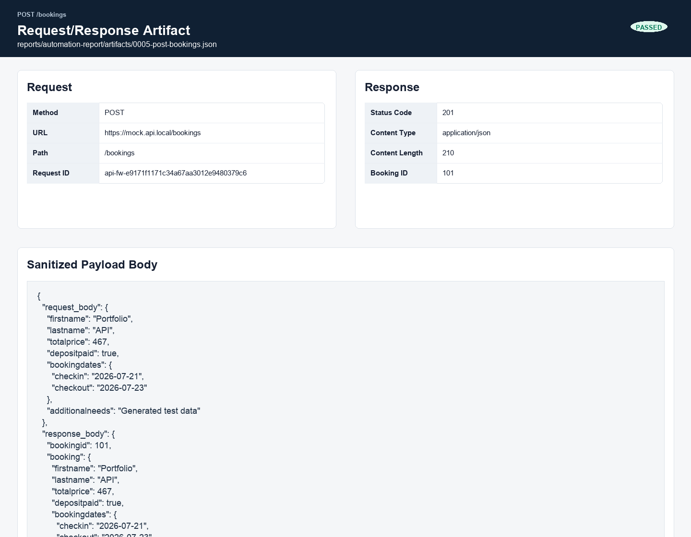

# API Framework Walkthrough

This walkthrough shows the shortest path from a fresh checkout to a passing mock API run with a core product report, artifacts, and a small starter-suite handoff.

The screenshots below were produced from a local mock smoke/contract run.

## 1. Set Up The Project

```bash
cd api-automation-framework
python3 -m venv .venv
source .venv/bin/activate
python -m pip install --upgrade pip
pip install -r requirements.txt -r requirements-dev.txt
cp .env.example .env
python framework.py doctor
```

`doctor` checks Python, dependencies, YAML config, writable artifact folders, core report readiness, optional Allure CLI availability, and API auth environment variables.

## 2. Run The Mock Smoke/Contract Suite

Use the mock environment when you want a deterministic run that does not need API secrets:

```bash
python framework.py run --env mock --markers "smoke or contract" --parallel auto --no-open-report
```

The command runs REST, GraphQL, and contract coverage, then generates the default automation-core product report.



The dashboard shows the run status, pass rate, active API profile, environment, and the test list. Contract checks appear alongside API smoke checks so a new suite can verify both behavior and schemas in one run.

## 3. Read API Details In The Core Report

Open the report locally when you want to inspect the run:

```bash
python framework.py report open --type core
```

The default report is written to:

```text
reports/automation-report/index.html
```

Test detail pages show the test status, API domain/profile/environment metadata, retries, attached artifacts, and timeline.



For API tests, the most useful evidence is usually in the attached request/response artifact. Open the JSON artifact from the test detail page to inspect the method, URL, path, request body, response status code, headers, and response body.



Schema and contract validations are regular pytest assertions. When they fail, the failure appears on the test detail page and the related request/response artifact stays linked for debugging. Sensitive values should be attached through the auth helpers so headers and payload fields are redacted before they are written to artifacts.

## 4. Know Where Output Goes

```text
reports/allure-results/                  # Raw pytest/Allure result files
reports/automation-report/index.html     # Default core product report
reports/automation-report/report-data.json # Structured report summary, timeline, and signals
reports/automation-report/artifacts/     # Bundled request/response JSON and logs
reports/environment-matrix/index.html    # Matrix dashboard
reports/environment-matrix/reports/mock/ # Mock environment drill-down report
reports/environment-matrix/logs/mock.log # Matrix pytest output
reports/framework.log                    # Framework command log
```

Generate a report from existing results without opening a browser:

```bash
python framework.py report generate --report-kind core --no-open
```

## 5. Try The Environment Matrix

Run a small matrix against the mock environment:

```bash
python framework.py run --matrix --envs mock --markers "smoke or contract" --parallel auto --no-open-report
```

Use multiple environments when `config/environments.yaml` has the target URLs:

```bash
python framework.py run --matrix --envs mock qa staging --env-workers 3 --parallel 2 --no-open-report
```

## 6. Choose A Report Kind

The core product report is the default:

```bash
python framework.py run --report-kind core
```

Other options are available when needed:

```bash
python framework.py run --report-kind summary --no-open-report
python framework.py run --report-kind allure --no-open-report
python framework.py run --report-kind both --no-open-report
```

Official Allure requires the Allure CLI. In `both` mode, the core report is generated first; if the official Allure CLI is missing, the run keeps the core report and logs a warning.

## 7. Use The Starter Project

For a product-specific API suite created from this template repository, copy the starter files into the generated repository root:

```bash
cp -R templates/starter_project/config/* config/
cp -R templates/starter_project/services/* services/
cp -R templates/starter_project/schemas/* schemas/
cp -R templates/starter_project/tests/* tests/
```

Then rename the sample service, schema, and test around your product API and run:

```bash
pytest tests/smoke/test_catalog_api.py --no-open-report
python framework.py report open --type core
```

Keep product-specific services under `services/`, request/response contracts under `schemas/` or `contracts/`, and reusable setup in fixtures or helpers. Shared, environment-neutral utilities should stay in `automation-core`.
